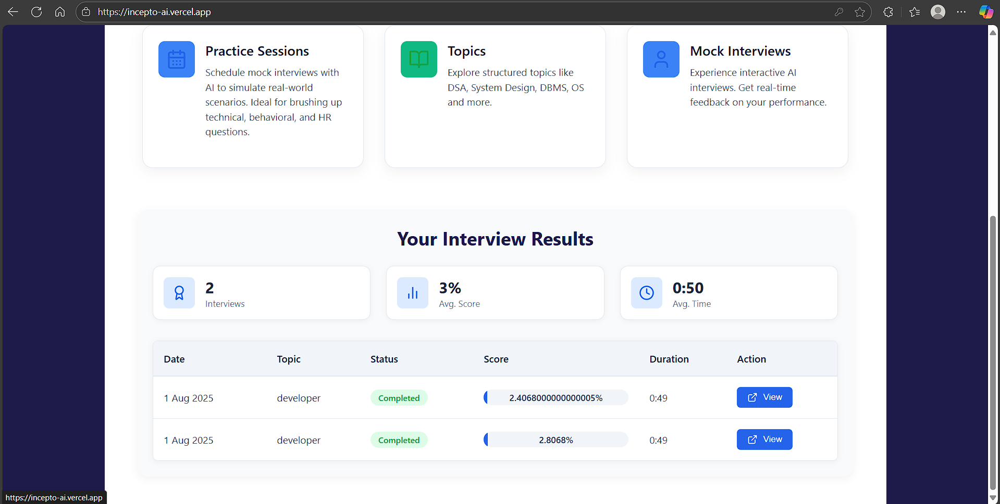
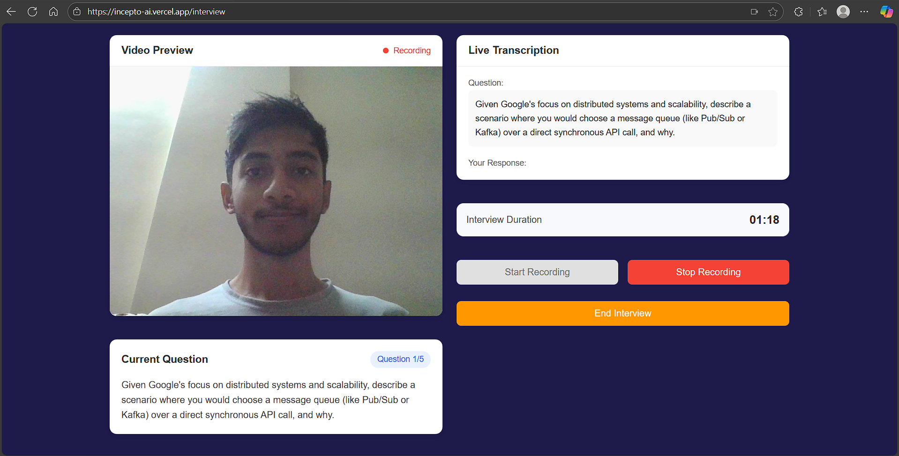
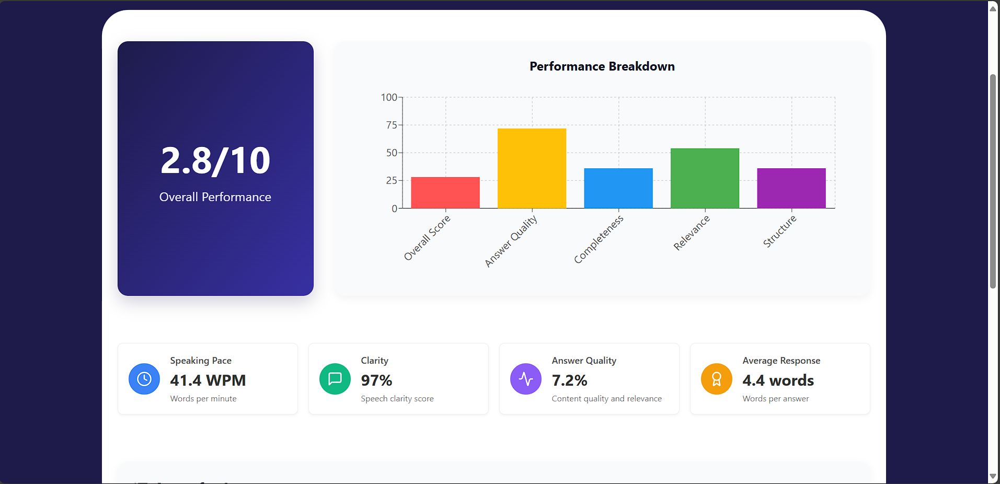
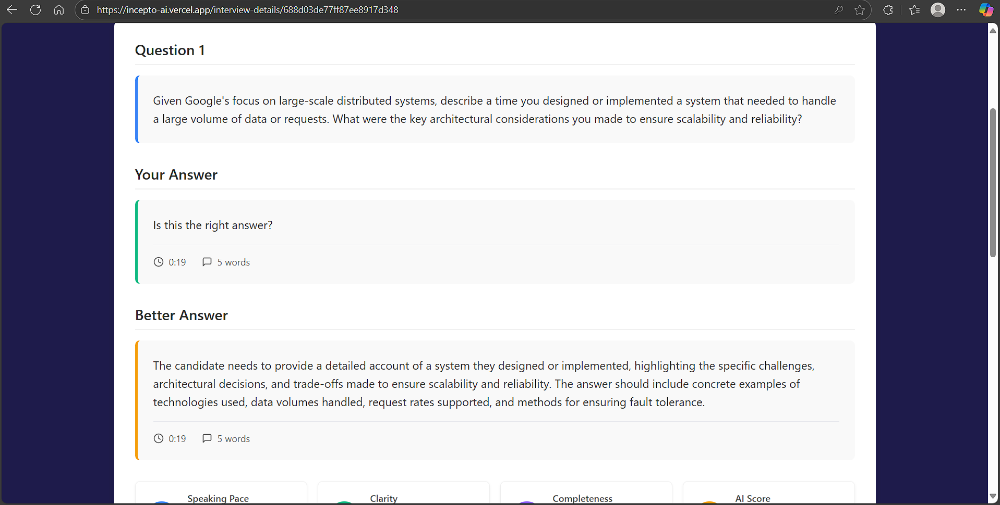

# Incepto AI  

Incepto AI is an **AI-powered interview preparation platform** that helps candidates practice mock interviews, receive real-time feedback, and analyze their performance across multiple dimensions. It integrates question generation, emotion/speech analysis, and result reporting into a seamless user experience.  

---

## 🚀 Features  

- **Smart Question Generation** – Dynamically fetches and curates questions based on company, role, or random selection.  
- **AI-Powered Analysis** – Evaluates candidate responses using speech patterns, filler words, confidence, and emotional cues.  
- **Video + Audio Insights** – Processes camera frames and recorded audio to measure both verbal and non-verbal performance.  
- **Comprehensive Reports** – Generates a detailed breakdown of candidate performance after each session.  
- **Admin Controls** – Manage question sets, configurations, and system behavior.  
- **Modern Web Interface** – Built with React for a smooth, user-friendly experience.  

---

## 🛠 Tech Stack  

- **Frontend**: React.js (Vercel hosting)  
- **Backend**: Node.js (Express), Python (Flask for ML/AI analysis, hosted on Render)  
- **Database**: MongoDB (Atlas / Compass)  
- **File Storage**: Cloudinary (for report storage and multimedia handling)  

---

## 📂 Project Workflow  

1. **Candidate starts a mock interview** via the React frontend.  
2. **Backend fetches interview questions** (based on company or random selection).  
3. **Frontend reads questions aloud** and records candidate’s response (video + audio).  
4. **Video frames** are streamed to the backend → analyzed for **emotions & confidence**.  
5. **Audio is processed** using ML models (via Flask) → analyzing **speech clarity, filler words, and WPM**.  
6. **Evaluation results** for each question are stored in MongoDB.  
7. **Final report** is generated and shown in a clean, user-friendly UI.  

---

## 📌 API Endpoints  

### 🔹 Question Management  
- `GET /api/questions/random` → Fetch random questions.  
- `GET /api/questions/company/:company` → Fetch company-specific questions.  

### 🔹 Interview Flow  
- `POST /api/interview/start` → Start a new interview session.  
- `POST /api/interview/answer` → Submit answer (audio + metadata).  
- `POST /api/interview/frame` → Send video frame for analysis.  
- `POST /api/interview/end` → End session and generate cumulative report.  

### 🔹 Reports  
- `GET /api/report/:sessionId` → Fetch the detailed report of a completed interview.  

---

## 📸 Screenshots  

- **Home Page**  
  

- **Interview Page**
  
  
- **Analysis Results**  
  
  

---

## ⚡️ How It Works  

Incepto AI follows an **API-first architecture**, ensuring the backend and AI analysis services are reusable and extendable. The **Node.js Express server** manages interview flow and communication, while the **Flask backend** performs deep audio/video analysis. All results are stored in MongoDB and presented via a modern **React.js frontend**.  

---

